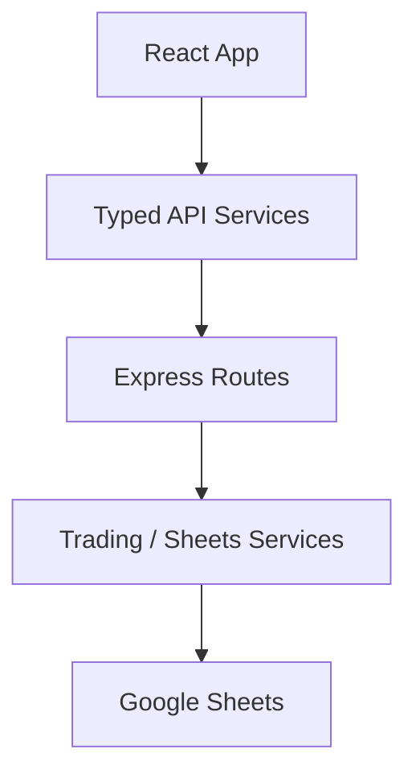

# Quant Game Modernized

This repository has been modernized into a React + TypeScript frontend with a TypeScript Express backend while preserving the current API surface and Sheets-based trading behavior.

## Structure

## Setup

1. Copy `.env.example` to `.env`.
2. Set `SHEET_ID` and `ADMIN_PASSWORD`.
3. Keep `credentials.json` available for Google Sheets auth.
4. Install dependencies with `npm install`.

## Development

- `npm run dev:client` starts Vite on port 5173.
- `npm run dev:server` starts the Express API on port 3000.
- `npm run dev` runs both.

## Production Build

- `npm run build`

The build emits the Vite client to `dist/` and the server TypeScript output to `dist/server/`.

## Deployment Notes

- The server is written to serve the built app when `dist/` exists.
- The API contract remains `/api/admin/*`, `/api/participant/*`, `/api/game-state`, and `/api/leaderboard`.
- Google Sheets remains the persistence layer for participant and leaderboard data.
